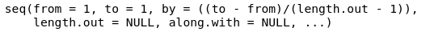

# Einführung ins *tidyverse*

Für dieses Kapitel benötigen Sie die folgenden Packages und Data Frames:

```{r}
library(tidyverse)
library(magrittr)
url <- "http://www.phonetik.uni-muenchen.de/~jmh/lehre/Rdf"
asp <- read.table(file.path(url, "asp.txt"))
int <- read.table(file.path(url, "intdauer.txt"))
vdata <- read.table(file.path(url, "vdata.txt"))
```

Nutzen Sie die Methoden aus Kapitel \@ref(eigenschaften), um sich mit den einzelnen Data Frames vertraut zu machen!

Das *tidyverse* ist eine Sammlung von Packages, die bei unterschiedlichen Aspekten der Datenverarbeitung helfen. Wir werden uns im Verlauf der nächsten Kapitel mit einigen dieser *tidyverse*-Packages beschäftigen. Wenn Sie das *tidyverse* laden, sehen Sie folgendes:


Zum *tidyverse* in der Version 2.0 gehören die neun dort aufgelisteten Packages (`dplyr`, `forcats`, `ggplot2`, `lubridate`, `purrr`, `readr`, `stringr`, `tibble`, `tidyr`). All diese Pakete können Sie auch einzeln laden, wenn Sie das möchten. Zusätzlich wird angezeigt, dass es zwei Konflikte gibt: Die Notation `dplyr::filter()` bedeutet "die Funktion `filter()` aus dem Paket `dplyr`". Diese Funktion überschreibt die Funktion `filter()` aus dem Paket `stats` (das ist ein Paket, das den NutzerInnen ohne vorheriges Laden mittels `library()` immer zur Verfügung steht). Funktionen aus verschiedenen Paketen können sich gegenseitig überschreiben, wenn sie denselben Funktionsnamen haben, wie z.B. `filter()`. Wenn man nun also `filter()` verwendet, wird die Funktion von `dplyr` verwendet, nicht die Funktion von `stats`. Wenn man explizit die Funktion von `stats` verwenden will, kann man die obige Notation verwenden, also `stats::filter()`.

Viele Funktionen aus dem *tidyverse* dienen dazu, traditionelle R Notationen abzulösen. Diese traditionellen Notationen sind häufig recht sperrig; *tidyverse*-Code hingegen ist leicht zu lesen und zu schreiben. Wir verwenden *tidyverse*, um Data Frames aufzuräumen, zu filtern oder zu verändern.

## Pipes

Dazu müssen wir zuerst lernen, wie die *tidyverse*-Syntax funktioniert:

```{r}
asp %>% head()
```

Wir beginnen den Code immer mit dem Date Frame und hängen dann einfach alle Funktionen, die wir auf den Data Frame anwenden wollen, in chronologischer Reihenfolge an den Data Frame. Zwischen jeder Funktion steht die **Pipe `%>%`**. Die Pipe nimmt immer das, was links von der Pipe steht, und reicht es weiter an die Funktion, die rechts von der Pipe steht. Im Code oben wird also die Funktion `head()` auf den Data Frame `asp` angewendet. Dies ist genau dasselbe wie:

```{r}
head(asp)
```

In der *tidyverse*-Schreibweise mit der einfachen Pipe wird der Data Frame nicht verändert; das Ergebnis des Codes wird einfach in der Konsole ausgegeben. Wenn Sie das Ergebnis einer *tidyverse*-Pipe in einer Variable abspeichern wollen, nutzen Sie die übliche Notation mit dem Zuweisungspfeil `<-`:

```{r}
numberOfRows <- asp %>% nrow()
numberOfRows
```

Das Besondere ist, dass Sie so viele Funktionen mit der Pipe aneinanderhängen können wie Sie wollen. Die Funktionen werden immer auf das Ergebnis der vorherigen Funktion angewendet, wie wir gleich sehen werden. Innerhalb der Funktionen können wir dank der Pipe auf alle Spalten des Data Frames einfach mittels ihres Namens zugreifen.

## Daten manipulieren mit `dplyr`

Die wichtigsten Funktionen, die Sie in Ihrem Alltag mit R brauchen werden, stammen aus dem Package [`dplyr`](https://dplyr.tidyverse.org/index.html). Wir unterteilen hier nach verschiedenen Arten von Operationen, die Sie auf Data Frames ausführen können.

### Filtering

Häufig werden wir aus Data Frames bestimmte Zeilen und/oder Spalten auswählen. Das Auswählen von Zeilen erfolgt mit der Funktion **`filter()`**. Als Argument(e) bekommt die Funktion einen oder mehrere logische Ausdrücke. Hierfür benötigen Sie die logischen Operatoren aus Kapitel \@ref(arithmetik-und-logische-operatoren). Wenn Sie aus dem Data Frame `asp` alle Zeilen auswählen wollen, bei denen in der Spalte `Wort` "Montag" steht, nutzen Sie beispielsweise den Operator `==`:

```{r}
asp %>% filter(Wort == "Montag")
```

Alle Zeilen, bei denen die Dauer `d` kleiner ist als 10 ms, erhält man mit folgendem Ausdruck:

```{r}
asp %>% filter(d < 10)
```

Sie können natürlich auch mehrere logische Ausdrücke miteinander verbinden, nämlich mittels den Operatoren für "und" `&` oder für "oder" `|`. Mit dem folgenden Ausdruck werden nur Zeilen zurückgegeben, bei denen die Versuchsperson `Vpn` entweder "k01" oder "k02" oder "k03" ist und der Konsonant `Kons` ungleich "t":

```{r}
asp %>% filter(Vpn %in% c("k01", "k02", "k03") & Kons != "t")
```

Die Zeilen in einem Data Frame sind normalerweise durchnummeriert, d.h. die Zeilen haben einen Index. Wenn wir mittels des Index Zeilen auswählen wollen, nutzen wir **`slice()`** bzw. die verwandten Funktionen `slice_head()`, `slice_tail()`, `slice_min()` und `slice_max()`. Die Funktion `slice()` bekommt als Argument den Index der auszuwählenden Zeilen:

```{r}
asp %>% slice(4)             # Zeile 4 auswählen
asp %>% slice(1:10)          # die ersten 10 Zeilen auswählen
```

Die Funktionen `slice_head()` und `slice_tail()` bekommen als Argument die Anzahl der Zeilen `n`, die, angefangen bei der ersten bzw. der letzten Zeile, ausgewählt werden sollen.

```{r}
asp %>% slice_head(n = 2)   # die ersten zwei Zeilen auswählen
asp %>% slice_tail(n = 3)   # die letzten drei Zeilen auswählen
```

Die Funktionen `slice_min()` und `slice_max()` geben die `n` Zeilen zurück, die die niedrigsten bzw. höchsten Werte in einer Spalte haben. Wenn `n` nicht angegeben wird, wird automatisch `n = 1` verwendet, es wird also nur eine Zeile zurückgegeben. 

<div class="gray">
**Weiterführende Infos: Defaults für Argumente**

Wenn man bestimmte Argumente in Funktionen nicht spezifiziert, werden häufig sog. *defaults* verwendet. Schauen Sie sich zum Beispiel die Hilfeseite der Funktion `seq()` an. Dort wird die Funktion mit ihren Argumenten wie folgt aufgeführt:



Die Argumente `from` und `to` haben den *default*-Wert 1. Und da dies die einzigen obligatorischen Argumente sind, können Sie die Funktion auch völlig ohne Angabe der Argumente ausführen:

```{r}
seq()
```

Auch das Argument `by` hat einen *default*-Wert, der anhand der Werte von `to`, `from` und `length.out` berechnet wird, falls der/die NutzerIn keinen anderen Wert eingibt.

Meist finden Sie die *default*-Werte für die Argumente einer Funktion auf der Hilfeseite unter *Usage*, manchmal stehen die *default*-Werte auch erst in der Beschreibung der Argumente darunter.
</div>

Im folgenden zeigen wir Beispiele für die zwei Funktionen, die sich auf die Dauer in Spalte `d` des Data Frames `asp` beziehen.

```{r}
asp %>% slice_min(d)        # die Zeile auswählen, wo d den niedrigsten Wert hat
asp %>% slice_min(d, n = 5) # die fünf Zeilen auswählen, wo d die niedrigsten Werte hat
asp %>% slice_max(d)        # die Zeile auswählen, wo d den höchsten Wert hat
asp %>% slice_max(d, n = 5) # die fünf Zeilen auswählen, wo d die höchsten Werte hat
```

Diese beiden Funktionen lassen sich sogar auf Spalten anwenden, die Schriftzeichen enthält. In diesem Fall wird alphabetisch vorgegangen.

```{r}
asp %>% slice_min(Wort)     # die Zeilen, wo Wort den "niedrigsten" Wert hat
asp %>% slice_max(Wort)     # die Zeilen, wo Wort den "höchsten" Wert hat
```

Da es jeweils mehrere Zeilen gibt, wo `Wort` den niedrigsten ("abkaufen") bzw. höchsten Wert ("Zwischenstop") hat, werden all diese Zeilen zurückgegeben (trotz `n = 1`).`

### Selecting

Für das Auswählen von Spalten ist die Funktion **`select()`** da, die auf verschiedene Art und Weise benutzt werden kann. Als Argumente bekommt diese Funktion die Spaltennamen, die ausgewählt werden sollen. In den folgenden Beispielen sehen Sie außerdem zum ersten Mal, wie man mehrere Funktionen mit einfachen Pipes aneinander hängen kann, denn wir nutzen nach `select()` hier noch `slice(1)`, damit der Output der Funktionen nicht so lang ist.

```{r}
asp %>% select(Vpn) %>% slice(1)         # nur die Spalte Vpn
asp %>% select(Vpn, Bet) %>% slice(1)    # die Spalten Vpn und Bet
asp %>% select(d:Kons) %>% slice(1)      # die Spalten d bis einschl. Kons
asp %>% select(!(d:Kons)) %>% slice(1)   # alle Spalten außer die Spalten von d bis einschl. Kons
asp %>% select(-Wort) %>% slice(1)       # alle Spalten außer Wort
```

Innerhalb der Funktion `select()` können die Funktionen **`starts_with()`** und **`ends_with()`** sehr praktisch sein, wenn Sie alle Spalten auswählen wollen, deren Namen mit demselben Buchstaben oder derselben Buchstabenfolge beginnen bzw. enden. Dies demonstrieren wir anhand des Data Frames `vdata`, der folgende Spalten hat:

```{r}
vdata %>% colnames()
```

`starts_with()` erlaubt es uns, die beiden Spalten `F1` und `F2` auszuwählen, weil beide mit "F" beginnen:

```{r}
vdata %>% select(starts_with("F")) %>% slice(1)
```

Wie auch beim Filtern, können Sie mit den logischen Operatoren `&` bzw. `|` die Funktionen `starts_with()` und `ends_with()` verbinden. Hier wählen wir (auf etwas umständliche Weise) die Spalte `F1` aus:

```{r}
vdata %>% select(starts_with("F") & !ends_with("2")) %>% slice(1)
```

Es wird ab und zu vorkommen, dass wir (nach einer ganzen Reihe an Funktionen) nur eine Spalte ausgegeben haben wollen, aber nicht als Spalte (bzw. um genau zu sein: als Data Frame mit nur einer Spalte), sondern einfach als Vektor. Dafür nutzen wir **`pull()`**. Im folgenden Beispiel wählen wir zuerst die ersten zehn Zeilen von `asp` aus und lassen uns davon dann die Spalte `Bet` als Vektor ausgeben:

```{r}
asp %>% slice(1:10) %>% pull(Bet)
```

An der Ausgabe sehen Sie, dass es sich bei `Bet` um einen Vektor handelt.

### Mutating

Mit *Mutating* können wir Spalten an Data Frames anhängen oder verändern. Der Befehl heißt **`mutate()`** und bekommt als Argumente den gewünschten neuen Spaltennamen mit den Werten, die in der Spalte stehen sollen. Wenn mehrere Spalten angelegt werden sollen, können Sie sie innerhalb der Funktion aneinanderreihen. Folgender Code legt zum Beispiel zwei neue Spalten namens `F1` und `F2` im Data Frame `int` an:

```{r}
int %>% head()
int %>% mutate(F1 = c(282, 277, 228, 270, 313, 293, 289, 380, 293, 307, 238, 359, 300, 318, 231),
               F2 = c(470, 516, 496, 530, 566, 465, 495, 577, 501, 579, 562, 542, 604, 491, 577))
```

Diese neuen Spalten werden nicht automatisch im Data Frame abgespeichert! Es gibt zwei Möglichkeiten, um die Spalten dauerhaft an den Data Frame anzuhängen. Die erste ist wie üblich mit dem Zuweisungspfeil. Wir erstellen hier eine neue Variable `int_new`, die den erweiterten Data Frame enthält; man hätte auch den originalen Data Frame überschreiben können, indem man statt `int_new` nur `int` schreibt.

```{r}
int_new <- int %>% 
  mutate(F1 = c(282, 277, 228, 270, 313, 293, 289, 380, 293, 307, 238, 359, 300, 318, 231),
         F2 = c(470, 516, 496, 530, 566, 465, 495, 577, 501, 579, 562, 542, 604, 491, 577))
int_new %>% head()
```

Die zweite Möglichkeit ist die sogenannte **Doppelpipe** aus dem Paket `magrittr`: **`%<>%`**. Die Doppelpipe kann nur als erste Pipe in einer Reihe von Pipes eingesetzt werden (auch das werden wir noch sehen). Zudem muss als erstes Argument nach der Doppelpipe nicht mehr der Data Frame stehen, denn der steht schon links von der Doppelpipe.

```{r}
int %<>% mutate(F1 = c(282, 277, 228, 270, 313, 293, 289, 380, 293, 307, 238, 359, 300, 318, 231),
                F2 = c(470, 516, 496, 530, 566, 465, 495, 577, 501, 579, 562, 542, 604, 491, 577))
int %>% head()
```

Es gibt zwei Funktionen, die sehr hilfreich innerhalb von `mutate()` sind, wenn eine neue Spalte auf den Werten einer bereits existierenden Spalte beruhen soll. Für binäre Entscheidungen nutzen Sie **`ifelse()`**, für nicht binäre Entscheidungen nutzen Sie **`case_when()`**. 

Nehmen wir an, Sie wollen eine weitere Spalte an den Data Frame `int` anhängen. Sie wissen, dass Versuchsperson "S1" 29 Jahre alt ist, Versuchsperson "S2" ist 33 Jahre alt. Sie wollen eine Spalte `age` anlegen, die genau das festhält. Dann benutzen Sie die Funktion `ifelse()` innerhalb von `mutate()`. `ifelse()` bekommt als Argumente zuerst einen logischen Ausdruck, dann den Wert, der eingesetzt werden soll, wenn der logische Ausdruck für eine Zeile wahr ist (`TRUE`), und zuletzt den Wert für Zeilen, für die der logische Ausdruck unwahr ist (`FALSE`). Um also die neue Spalte zu erstellen, wird für jede Zeile geprüft, ob die Versuchsperson "S1" ist; wenn ja, wird in die neue Spalte `age` der Wert 29 eingetragen, ansonsten der Wert 33.

```{r}
int %>% mutate(age = ifelse(Vpn == "S1", 29, 33))
```

Bei nicht binären Entscheidungen wird statt `ifelse()` die Funktion `case_when()` eingesetzt. Diese Funktion bekommt so viele logische Ausdrücke und entsprechende Werte wie gewünscht. Zum Data Frame `int` wollen Sie eine weitere Spalte namens `noise` hinzufügen. Wenn in der Spalte `dB` ein Wert unter 25 Dezibel steht, soll in der Spalte `noise` "leise" stehen, bei Dezibelwerten zwischen 25 und 35 soll "mittel" und bei Dezibelwerten über 35 soll "laut" eingetragen werden. Die Schreibweise dieser Bedingungen ist wie folgt: Zuerst kommt der logische Ausdruck, dann die Tilde `~`, und abschließend der einzutragende Wert, wenn der logische Ausdruck für eine Zeile wahr ist.

```{r}
int %>% mutate(noise = case_when(dB < 25 ~ "leise",
                                 dB > 25 & dB < 35 ~ "mittel",
                                 dB > 35 ~ "laut"))
```

### Renaming

Häufig ist es sinnvoll, Spalten umzubenennen und ihnen vernünftige Namen zu geben. (Generell ist es sinnvoll, den Spalten von Anfang an sprechende Namen zu geben, also Namen, die zweifelsfrei beschreiben, was in der Spalte zu finden ist -- dies ist nicht trivial!)

Im Data Frame `asp` sind fast alle Spaltennamen Abkürzungen:

```{r}
asp %>% colnames()
```

Jetzt benennen wir die Spalten um und speichern das Ergebnis mittels der Doppelpipe direkt im Data Frame `asp` ab. Hierzu benutzen wir **`rename()`**. Als Argumente bekommt die Funktion zuerst den gewünschten Spaltennamen, dann ein `=`, und dann den alten Spaltennamen. Sie brauchen die Spaltennamen nicht in Anführungszeichen zu setzen. Wenn Sie gleich mehrere Spalten umbenennen wollen, können Sie das einfach mit Komma getrennt in der Funktion angeben.

```{r}
asp %<>% rename(Dauer = d, 
                Versuchsperson = Vpn, 
                Konsonant = Kons, 
                Betonung = Bet)
asp %>% colnames()
```

## Weitere Beispiele für komplexe Pipes

Wie Sie bereits gesehen haben, lassen sich viele Funktionen mit Pipes aneinanderhängen. Es ist dabei sehr wichtig, sich immer wieder vor Augen zu führen, dass jede Funktion auf das Ergebnis der vorherigen Funktion angewendet wird. Bei langen Pipes sollten Sie außerdem nach jeder Pipe einen Zeilenumbruch einfügen, weil dies die Lesbarkeit erhöht.

Die beiden folgenden Schreibweisen haben dasselbe Ergebnis und werfen auch keinen Fehler, aber sie gehen unterschiedlich vor. Im ersten Beispiel wird zuerst die Spalte `Versuchsperson` ausgewählt, dann wird die erste Zeile ausgewählt, beim zweiten Beispiel genau umgekehrt.

```{r}
asp %>% 
  select(Versuchsperson) %>% 
  slice(1)
asp %>% 
  slice(1) %>% 
  select(Versuchsperson)
```

Das kann unter Umständen zu Fehlern führen, wenn Sie nicht genau aufpassen, in welcher Reihenfolge Sie Funktionen auf einen Data Frame anwenden. Sie möchten zum Beispiel aus dem Data Frame `vdata` die Spalte `X` auswählen, aber auch in `Alter` umbenennen. Dann wird der folgende Code einen Fehler werfen, weil sich die Funktion `select()` nicht mehr auf die Spalte `X` anwenden lässt, *nachdem* die Spalte bereits in `Alter` umbenannt wurde:

```{r, error=TRUE}
vdata %>% 
  rename(Alter = X) %>% 
  select(X)
```

Der Fehler hier sagt Ihnen zum Glück genau, was falsch gelaufen ist. Richtig geht es also so (wir benutzen zusätzlich `slice(1:10)`, damit der Output nicht so lang ist):

```{r}
vdata %>% 
  select(X) %>% 
  rename(Alter = X) %>% 
  slice(1:10)
```

Ein weiteres Beispiel. Sie möchten aus dem Data Frame `int` die Dauerwerte erfahren, wenn F1 unter 270 Hz liegt.

```{r, error=TRUE}
int %>% 
  pull(Dauer) %>% 
  filter(F1 < 270)
```

Dieser Fehler ist schon etwas kryptischer. Rekonstruieren wir also, was schief gelaufen ist. Aus dem Data Frame `int` haben wir die Spalte `Dauer` gezogen, die auch existiert. Dafür haben wir aber `pull()` verwendet, und `pull()` gibt Spalten in Form eines Vektors aus. Wir können das nochmal überprüfen wie folgt:

```{r}
int %>% pull(Dauer)
int %>% pull(Dauer) %>% class()
```

Ja, dies ist ein Vektor mit *integers*. Oben haben wir dann versucht, auf diesen numerischen Vektor eine Funktion anzuwenden, die für Data Frames gedacht ist -- daher der Fehler. Die Lösung ist in diesem Fall also, *zuerst* zu filtern, und dann die Werte ausgeben zu lassen:

```{r}
int %>% 
  filter(F1 < 270) %>% 
  pull(Dauer)
```

Dies sind die Dauerwerte für die drei Zeilen, bei denen F1 unter 270 Hz liegt.

Zuletzt wollen wir hier noch ein Beispiel für eine komplexe Pipe mit der Doppelpipe am Anfang zeigen. Was wir also jetzt tun, wird sofort in den Data Frame geschrieben, und nicht einfach in der Konsole ausgegeben. Wir möchten die Spalte `noise` jetzt dauerhaft im Data Frame `int` anlegen, dann alle Zeilen auswählen, wo die Versuchsperson "S1" ist und die Dauer zwischen 100 und 200 ms liegt, und zuletzt die Spalten `noise` und `Dauer` sowie die ersten fünf Zeilen auswählen.

```{r}
int %<>% 
  mutate(noise = case_when(dB < 25 ~ "leise",
                           dB > 25 & dB < 35 ~ "mittel",
                           dB > 35 ~ "laut")) %>% 
  filter(Vpn == "S1" & Dauer > 100 & Dauer < 200) %>% 
  select(Dauer, noise) %>% 
  slice_head(n = 5)
int
```

Der Data Frame `int` besteht jetzt nur noch aus zwei Spalten und fünf Zeilen, und diese Aktion kann auch nicht rückgängig gemacht werden. Seien Sie also vorsichtig und überlegen Sie genau, ob Sie einen Data Frame mit dem Ergebnis einer Pipe überschreiben wollen.

