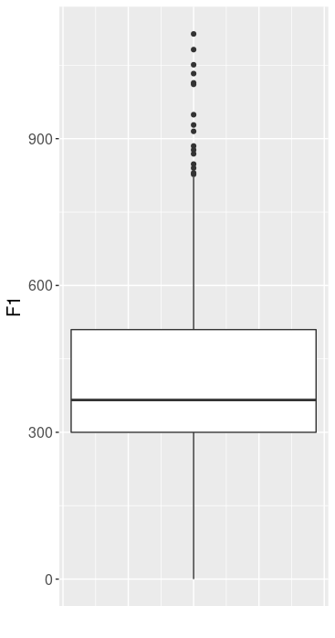

# Deskriptive Statistik

Für dieses Kapitel benötigen Sie die folgenden Packages und den folgenden Data Frame:

```{r}
library(tidyverse)
library(magrittr)
url <- "http://www.phonetik.uni-muenchen.de/~jmh/lehre/Rdf"
vdata <- read.table(file.path(url, "vdata.txt"))
```

Wenn man sich einen Überblick über Daten verschaffen möchte, sind sogenannte *summary statitics* (deskriptive Statistiken) häufig hilfreich. Zu solchen deskriptiven Werten zählen z.B. das arithmetische Mittel (Mittelwert), Median, Varianz, Standardabweichung, Minimum, Maximum, usw. Hier zeigen wir zunächst wie man solche Werte ohne Funktionen aus dem *tidyverse* berechnen kann. Da R eine Statistik-Software ist, sind solche Basis-Funktionen wie zur Berechnung des Mittelwerts immer verfügbar. Im Folgenden demonstrieren wir die wichtigsten Funktionen zur Berechnung von *summary statistics* anhand der F1-Werte in `vdata`:

```{r}
mean(vdata$F1)             # arithmetisches Mittel
median(vdata$F1)           # Median
var(vdata$F1)              # Varianz
sd(vdata$F1)               # Standardabweichung
min(vdata$F1)              # Minimum
max(vdata$F1)              # Maximum
range(vdata$F1)            # Minimum & Maximum
quantile(vdata$F1, 0.25)   # 1. Quartil
quantile(vdata$F1, 0.75)   # 3. Quartil
IQR(vdata$F1)              # interquartiler Bereich
```

## Mittelwert & Median

Das arithmetische Mittel wird berechnet, indem man die Summe einer Anzahl $n$ an Zahlen bildet, und diese Summe dann durch die Anzahl $n$ teilt. Hier ist ein sehr einfaches Beispiel:

```{r}
zahlen <- 1:5
summe <- sum(zahlen)
summe
anzahl <- length(zahlen)
anzahl
# Mittelwert:
summe/anzahl
# zum Vergleich:
mean(zahlen)
```

Der Median hingegen ist die mittig liegende Zahl in einer sortierten Zahlenreihe. Nehmen wir wieder obiges Beispiel (die Zahlen sind bereits aufsteigend sortiert):

```{r}
zahlen
median(zahlen)
```

Bei einer geraden Anzahl von Zahlen berechnet man den Median als den Mittelwert der zwei mittig liegenden Werte, zum Beispiel:

```{r}
zahlen <- 1:6
median(zahlen)
mean(c(3, 4))
```

Der Median ist robuster gegen sogenannte Ausreißer (engl. *outlier*) als der Mittelwert. Ausreißer sind Datenpunkte, die deutlich extremer sind als die Mehrheit der Datenpunkte. Hier wieder ein einfaches Beispiel:

```{r}
zahlen <- c(1:5, 100)
zahlen
mean(zahlen)
median(zahlen)
```

Die Zahl 100 ist ganz offensichtlich ein Ausreißer im Vektor `zahlen`. Der Mittelwert ist wegen dieses Ausreißers jetzt um ein Vielfaches höher als vorher, während der Median sich nur leicht verändert hat.

## Varianz & Standardabweichung

Varianz und Standardabweichung sind verwandte Maße für die Streuung von Werten um ihren Mittelwert. Genauer gesagt ist die Varianz die Summe der quadrierten Abweichungen der Messwerte von ihrem Mittelwert geteilt durch die Anzahl der Messwerte minus 1, während die Standardabweichung die Quadratwurzel der Varianz ist. Am folgenden Beispiel können Sie nachvollziehen, wie man die Varianz und Standardabweichung "händisch" berechnet:

```{r}
zahlen <- c(12, 6, 24, 3, 17)
# Mittelwert
m <- mean(zahlen)
m
# quadrierte Abweichungen
quadr_abw <- (zahlen - m)^2
quadr_abw
# Anzahl der Messwerte
n <- length(zahlen)
n
# Summe der quadrierten Abweichungen
summe <- sum(quadr_abw)
summe
# Varianz:
varianz <- summe / (n - 1)
varianz
# Mit der Funktion var():
var(zahlen)
```

Um jetzt die Standardabweichung daraus zu berechnen, die in der Statistik viel häufiger verwendet wird als die Varianz, brauchen wir nur noch die Quadratwurzel aus der Varianz zu ziehen:

```{r}
std_abw <- sqrt(varianz)
std_abw
# oder mit sd()
sd(zahlen)
```

## Quantile

Ein Quantil teilt Datenpunkte so auf, dass ein bestimmter Teil der Datenpunkte unterhalb des Quantils liegen. Quantil ist ein Überbegriff; je nachdem in wie viele Stücke man die Datenpunkte aufteilt, sagt man auch Perzentil (100 Stücke) oder Quartil (4 Stücke). Der Median ist ebenfalls ein Quantil, denn 50% der Daten liegen immer unter dem Median. In R berechnet die Funktion `quantile()` die Quantile. Die Funktion bekommt zuerst die Datenpunkte (also einen numerischen Vektor) und anschließend die Proportion der Datenpunkte, die unter dem zu berechnenden Wert liegen soll. Wichtige Quantile sind das erste und dritte Quartil, also die Schwellwerte, unter denen ein Viertel bzw. drei Viertel aller Datenpunkte liegen. 

```{r}
quantile(vdata$F1, 0.25)   # 1. Quartil
quantile(vdata$F1, 0.75)   # 3. Quartil
IQR(vdata$F1)              # interquartiler Bereich
```

Die Differenz zwischen dem ersten und dritten Quartil wird auch interquartiler Bereich oder Interquartilsabstand (*interquartile range*) genannt und kann mit der Funktion `IQR()` berechnet werden.

## Beispiel Boxplot

Ein Boxplot enthält viele der deskriptiven Informationen, die wir bis jetzt behandelt haben:

- Median: Der Strich innerhalb der Box ist der Median.
- Box: Die Box umfasst die mittleren 50% aller Datenpunkte. Das untere Ende der Box ist das erste Quartil (Q1), das obere Ende ist das dritte Quartil (Q3). Das heißt die Box ist genauso groß wie der Interquartilsabstand.
- Whiskers: Die Whiskers erstrecken sich vom Q1 und vom Q3 aus zu dem niedrigsten/höchsten Datenpunkt, der innerhalb von `1.5 * IQR` liegt. Diese Berechnung der Länge der Whiskers als `1.5 * IQR` gilt für Boxplots, die mit `ggplot2` erstellt wurden, aber nicht jeder Boxplot wird so berechnet.
- Punkte: Ausreißer, also alle restlichen Datenpunkte, die nicht in der Box und den Whiskers enthalten sind.

Hier sehen Sie den Boxplot für `F1` aus dem Data Frame `vdata`:



Wie man diesen Boxplot erstellt, erfahren Sie später in diesem Kurs.

