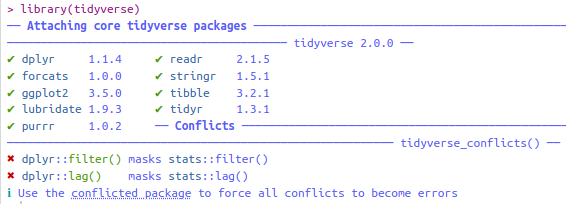
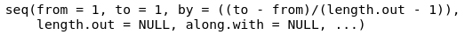

# Introduction to the tidyverse

For this chapter you will need the following packages and data frames:

```{r}
library(tidyverse)
library(magrittr)
url <- "http://www.phonetik.uni-muenchen.de/~jmh/lehre/Rdf"
asp <- read.table(file.path(url, "asp.txt"))
int <- read.table(file.path(url, "intdauer.txt"))
vdata <- read.table(file.path(url, "vdata.txt"))
```

Please use the methods from chapter \@ref{characteristics} to familiarise yourself with the three data frames!

The *tidyverse* is a collection of packages that help with the diverse aspects of data processing. We will work with a subset of these packages in this and the following chapters. When you load the tidyverse you'll see the following output:



The tidyverse, version 2.0, consists of the listed nine packages (`dplyr`, `forcats`, `ggplot2`, `lubridate`, `purrr`, `readr`, `stringr`, `tibble`, `tidyr`). Each of them can also be loaded separately. Additionally, the output above shows two conflicts. The notation `dplyr::filter()` translates to "the function `filter()` from the package `dplyr`". This function overwrites the function `filter()` from the package `stats` (which is one of the packages that is available upon starting RStudio, i.e. without having to load it using `library()`). Functions from distinct packages can overwrite each other when they have the same function name, e.g. `filter()`. If you were to use `filter()` in your code now, you would be using the function from `dplyr` and not the one from `stats`. If you explicitly want to use the function from `stats`, just use the notation shown above, i.e. `stats::filter()`.

Many functions of the tidyverse replace traditional R notations which are often less easy to read and write than tidyverse code. We will use the tidyverse to clean up data frames, filter or manipulate them.

## Pipes

First, we have to learn the tidyverse syntax:

```{r}
asp %>% head()
```

We begin each snippet of code with the data frame and then just add the functions that we want to apply to the data frame in chronological order. Between each function you put the **pipe symbol `%>%`** the pipe always takes the object on its left-hand side and submits it to the function on its right-hand side. So in this code snippet above, the function `head()` is applied to the data frame `asp`. This has exactly the same effect as:

```{r}
head(asp)
```

Using the simple pipe in a snippet of tidyverse code, the data frame is not changed. The result of the code is simply printed in the console. If, however, you want to save the result of a tidyverse pipe in a variable you can use the usual notation with the arrow `<-`:

```{r}
numberOfRows <- asp %>% nrow()
numberOfRows
```

The special thing is that you can attach as many functions to a pipe as you want. The functions will then always be applied to the result from the previous function, as we will see soon. Within a function you can access the columns of the data frame by means of their name, without using any special symbols or notations.

## Manipulating Data with `dplyr`

The most important functions which you will need in your day-to-day usage of R are part of the package [`dplyr`](https://dplyr.tidyverse.org/index.html). We differentiate here between different kinds of operations that you can apply to data frames using `dplyr` functions.

### Filtering

A common task is filtering or selecting certain rows and/or columns. You can choose certain rows by means of the function **`filter()`**. The argument(s) of that function is/are one or more logical expressions using the logical operators from chapter \@ref(arithmetic-and-logical-operators). If you want to select all rows of the data frame `asp` for which the string "Montag" is in the column `Wort`, you can use the operator `==`:

```{r}
asp %>% filter(Wort == "Montag")
```

All rows for which the duration `d` is lower than 10 ms is given by the following expression:

```{r}
asp %>% filter(d < 10)
```

Of course you can connect several logical expressions using the logical operators for "and" `&` or for "or" `|`. The following expression, for instance, only returns rows for which the participant `Vpn` is either "k01" or "k02" or "k03" and the consonant `Kons` is not "t":

```{r}
asp %>% filter(Vpn %in% c("k01", "k02", "k03") & Kons != "t")
```

The rows in a data frame are usually numbered, i.e. all rows have an index. If you want to select rows by their index, use **`slice()`** or the related functions `slice_head()`, `slice_tail()`, `slice_min()` and `slice_max()`. The function `slice()` takes the index of the rows to be selected as its only argument:

```{r}
asp %>% slice(4)             # select row 4
asp %>% slice(1:10)          # select the first 10 rows
```

The functions `slice_head()` and `slice_tail()` have an argument `n` which is the amount of rows starting with the first or last, respectively, that are to be selected.

```{r}
asp %>% slice_head(n = 2)   # select the first two rows
asp %>% slice_tail(n = 3)   # select the last three rows
```

The functions `slice_min()` and `slice_max()` return the `n` rows that have the lowest, respectively highest, values in a given column. If `n` is not provided by the user, the function automatically uses `n = 1`, i.e. only one row is returned.

<div class="gray">
**Further Information: Defaults for arguments**

If you do not specify certain arguments in functions, often the *default* values will be used. For an example, look at the help page of the function `seq()`. This tells you the following information about this function and its arguments:



The arguments `from` and `to` have the default value 1. And since these are the only obligatory arguments in that case, you can actually execute the function without giving it any arguments explicitly:

```{r}
seq()
```

The argument `by` also has a default value that is calculated from the values of `to`, `from` and `length.out` unless the user supplies the argument.

Often you can find the defaults for arguments on the help pages under *Usage*, sometimes they are only provided in the description of the arguments below that.
</div>

Here are two examples for the two functions which refer to the duration in column `d` of the data frame `asp`.

```{r}
asp %>% slice_min(d)        # choose the row where d has the lowest value
asp %>% slice_min(d, n = 5) # choose the five rows where d has the lowest values
asp %>% slice_max(d)        # choose the row where d has the highest value
asp %>% slice_max(d, n = 5) # choose the five rows where d has the highest values
```

These two functions can even be applied to columns that contain strings. In this case the selection is done alphabetically.

```{r}
asp %>% slice_min(Wort)     # choose the row where Wort has the "lowest" value
asp %>% slice_max(Wort)     # choose the row where Wort has the "highest" value
```

Since there are several rows for which the column `Wort` has the lowest ("abkaufen") respectively highest value ("Zwischenstop"), all of these rows are returned despite `n = 1`.

### Selecting

The function for selecting columns is called **`select()`** which can be used in several ways. The only arguments to the function are the names of the columns to be selected. In the following examples you'll also see for the first time how to concatenate several functions, because we'll limit the output of the `select()` function by adding `slice(1)` for pure visual reasons.

```{r}
asp %>% select(Vpn) %>% slice(1)         # only column Vpn
asp %>% select(Vpn, Bet) %>% slice(1)    # columns Vpn and Bet
asp %>% select(d:Kons) %>% slice(1)      # columns d until Kons
asp %>% select(!(d:Kons)) %>% slice(1)   # all columns except those between d and Kons
asp %>% select(-Wort) %>% slice(1)       # all columns except Wort
```

Within the function `select()` it can be helpful to use the functions **`starts_with()`** and **`ends_with()`**, if you want to select all columns whose name starts or ends with the same letter(s). We'll demonstrate this using the data frame `vdata` which has the following columns:

```{r}
vdata %>% colnames()
```

`starts_with()` allows us to select `F1` and `F2` because both start with "F":

```{r}
vdata %>% select(starts_with("F")) %>% slice(1)
```

Similarly to what you have learnt about filtering, you can connect the functions `starts_with()` and `ends_with()` using the logical operators `&` and `|`. Here we select the column "F1" (admittedly in a pretty laborious way):

```{r}
vdata %>% select(starts_with("F") & !ends_with("2")) %>% slice(1)
```

Sometimes we do not want our tidyverse pipes to return a column in the form of a data frame, but as a simple vector. This can be done with **`pull()`**. In the following pipe, we first choose the first ten rows of `asp` and then want to return the column `Bet` as a vector:

```{r}
asp %>% slice(1:10) %>% pull(Bet)
```

In the output you see that `Bet` was indeed returned as a vector.

### Mutating

Mutating here means to add or change columns in data frames. The command to do that is called **`mutate()`** and takes as arguments the new columns and the values to fill the columns. When you want to add several new columns you can do so in the same `mutate()` command. The following code, for instance, adds two new columns called `F1` and `F2` to the data frame `int`:

```{r}
int %>% head()
int %>% mutate(F1 = c(282, 277, 228, 270, 313, 293, 289, 380, 293, 307, 238, 359, 300, 318, 231),
               F2 = c(470, 516, 496, 530, 566, 465, 495, 577, 501, 579, 562, 542, 604, 491, 577))
```

These new columns are not automatically saved in the data frame! There are two ways to attach new columns to a data frame permanently. The first is as usually with the arrow `<-`. Let's create a new variable `int_new` that contains the data frame `int` including the two new columns (we also could have overwritten the original data frame `int` with the mutated data frame by calling the variable `int`).

```{r}
int_new <- int %>% 
  mutate(F1 = c(282, 277, 228, 270, 313, 293, 289, 380, 293, 307, 238, 359, 300, 318, 231),
         F2 = c(470, 516, 496, 530, 566, 465, 495, 577, 501, 579, 562, 542, 604, 491, 577))
int_new %>% head()
```

The second way is the so-called **double pipe** from the package `magrittr`: **`%<>%`**. The double pipe can only be the first pipe in a line of pipes (as we shall see soon). Furthermore you only need to put the data frame to be overwritten to the left of the double pipe, not again on the right.

```{r}
int %<>% mutate(F1 = c(282, 277, 228, 270, 313, 293, 289, 380, 293, 307, 238, 359, 300, 318, 231),
                F2 = c(470, 516, 496, 530, 566, 465, 495, 577, 501, 579, 562, 542, 604, 491, 577))
int %>% head()
```

There are two functions that are very useful within `mutate()` if the values of a new column are dependent on those of existing columns. For binary decisions you can use **`ifelse()`**, otherwise **`case_when()`**. 

Let's assume you want to attach another column to the data frame `int`. You know that participant "S1" is 29 years old, whereas participant "S2" is 33 years old. You want to add a column `age` with that information. In that case, you should use `ifelse()` within `mutate()`. `ifelse()` takes as arguments a logical expression, then the value for rows for which that expression evaluates to `TRUE`, and lastly the value for rows for which the expression is `FALSE`. When you execute this command, it is tested for every row whether the participant is "S1", if so, it puts the value 29 in the new column `age`, otherwise it puts the value 33.

```{r}
int %>% mutate(age = ifelse(Vpn == "S1", 29, 33))
```

When this kind of decision is non-binary, you can use the function `case_when()`. This function takes as many logical expressions and corresponding values as desired. We'll add another new column to the data frame `int` which will be called `noise`. When the column `dB` has a value of below 25 decibels, the column `noise` should have the value "quiet", for noise levels between 25 and 35 it should say "mid", and for values above 35 decibels it should say "loud". The notation of these conditions is as follows: First the logical expression, then a tilde `~`, and finally the value to be written into the new column if the logical expression is `TRUE`.

```{r}
int %>% mutate(noise = case_when(dB < 25 ~ "quiet",
                                 dB > 25 & dB < 35 ~ "mid",
                                 dB > 35 ~ "loud"))
```

### Renaming

Columns should always be given reasonable names, i.e. names that tell you exactly and concisely what the content of the column is -- this is not a trivial demand!). 

In the data frame `asp` almost all column names are abbreviations:

```{r}
asp %>% colnames()
```

Using the function **`rename()`** we'll rename all the columns and save the result directly in `asp` using the double pipe. The arguments of that function are the desired column name, then `=`, and then the old column name. You do not need to put the column names in quotes. You can also rename several columns at once.

```{r}
asp %<>% rename(duration = d, 
                subject = Vpn, 
                consonant = Kons, 
                stress = Bet)
asp %>% colnames()
```

## More Examples of Complex Pipes

As you have seen already, you can concatenate multiple functions using pipes. While doing that, it is very important to consider that each function is applied to the result of the previous function. If you write long pipes (i.e. several functions connected via `%>%`), you should always add a line break right after the `%>%` for reasons of legibility.

The following two pipes have the same result and do not throw any error, but they progress differently. In the first example, the column `subject` is selected before the first row is returned, in the second example the steps are reversed.

```{r}
asp %>% 
  select(subject) %>% 
  slice(1)
asp %>% 
  slice(1) %>% 
  select(subject)
```

Such pipes can occasionally lead to errors if you do not decide carefully which functions to execute first. For instance, let's say you want to select the column `X` from the data frame `vdata` but you also want to rename it to `age`. The following code is going to throw an error because the function `select()` can not be applied to a column `X` after that column has been renamed to `age`:

```{r, error=TRUE}
vdata %>% 
  rename(age = X) %>% 
  select(X)
```

This error also tells you exactly what went wrong. The correct order of functions is this (we also use `slice(1:10)` to reduce the visible output):

```{r}
vdata %>% 
  select(X) %>% 
  rename(age = X) %>% 
  slice(1:10)
```

Another example: you want to be given the duration values (`Dauer`) in `int` for F1 values below 270 Hz.

```{r, error=TRUE}
int %>% 
  pull(Dauer) %>% 
  filter(F1 < 270)
```

This error is much more cryptic. Let's reconstruct what went wrong. We pulled the column `Dauer` from the data frame `int`, and that column does exist. However, we used `pull()` for that operation, which returns the column as a vector, and not as a data frame. You can test this as follows:

```{r}
int %>% pull(Dauer)
int %>% pull(Dauer) %>% class()
```

Yes, this is a vector of integers. In the code above, we then tried to apply a function to that vector that is meant to be applied to data frames only -- that's why the pipe threw an error. The solution in this case is to filter *first*, and then pull the duration values:

```{r}
int %>% 
  filter(F1 < 270) %>% 
  pull(Dauer)
```

These are the duration values for the three rows for which F1 is lower than 270 Hz.

Finally, we want to show an example of a complex pipe using the double pipe at the beginning. So what we do here will overwrite the data frame, and not just print the result in the console. We want to add the column `noise` to the data frame `int` permanently now, then select all rows for which the subject is "S1" and the duration is between 100 and 200 ms, and lastly we want to select the columns `noise` and `Dauer` as well as the first five rows.

```{r}
int %<>% 
  mutate(noise = case_when(dB < 25 ~ "quiet",
                           dB > 25 & dB < 35 ~ "mid",
                           dB > 35 ~ "loud")) %>% 
  filter(Vpn == "S1" & Dauer > 100 & Dauer < 200) %>% 
  select(Dauer, noise) %>% 
  slice_head(n = 5)
int
```

The data frame `int` now only consists of two columns and five rows and this operation can not be undone. So please be careful and think about whether or not you want to overwrite a data frame with the result of a pipe.

